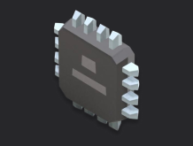

# Framework Parallel Phases



Four-phase Framework procedure showing parallel execution. After `initialize`, three independent test phases (voltage, current, temperature) run simultaneously because they all `depends_on: initialize` and have no dependency on each other.

## What's Inside

- `procedure.yaml`: defines four phases with a fan-out dependency graph
- `phases/initialize.py`: setup before parallel tests
- `phases/voltage_test.py`: independent voltage measurement
- `phases/current_test.py`: independent current measurement
- `phases/temperature_test.py`: independent temperature measurement
- `pyproject.toml`: uv-managed Python project

## Use This Template

Clone it from the **New Procedure** flow in TofuPilot. TofuPilot creates the repository in your account, links a procedure, builds the first deployment, and pushes it to a station.

## Structure

```
.
├── procedure.yaml
├── phases/
│   ├── initialize.py
│   ├── voltage_test.py
│   ├── current_test.py
│   └── temperature_test.py
├── pyproject.toml
└── README.md
```

## Key Concepts

- **`depends_on`**: declares ordering. Phases with the same dependencies and no dependency on each other are eligible to run in parallel.
- **No code changes needed**: the runtime decides parallelism from the dependency graph; phases are written exactly like serial phases.
- **Measurements are independent**: each parallel phase records its own measurements with its own validators.

## Next Steps

See the [TofuPilot guides](https://www.tofupilot.com/guides) for more templates.
